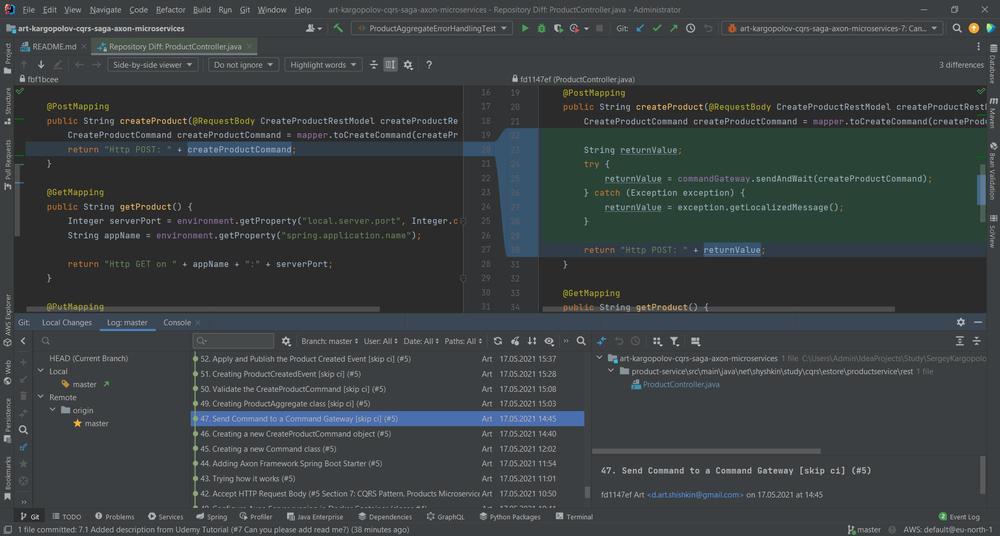

![Spring Boot version][springver]
![Axon version][axonver]
![Docker][docker]
![Testcontainers version][testcontainersver]
![Project licence][licence]

# Event-Driven Microservices, CQRS, SAGA, Axon, Spring Boot

Tutorial - [Spring Boot Microservices, CQRS, SAGA, Axon Framework](https://www.udemy.com/course/spring-boot-microservices-cqrs-saga-axon-framework/) - from Sergey Kargopolov (Udemy)

### Topics covered by tutorial

- Event-Driven Microservices
- Basics of Spring Cloud
- Axon Framework
- Eureka Discovery Service
- CQRS Design Pattern
- Spring Cloud API Gateway
- SAGA Design Pattern
- Event Based Messages
- Transactions

### Description

In this video course, you will learn how to build business logic that spans several **distributed Spring Boot Microservices**.

This course is designed for beginners and we will start from the basics of Microservices, Spring Boot, and **Spring Cloud**.

You will learn how to create your very first Spring Boot Microservice and how to handle HTTP requests. 
You will then learn how to run multiple instances of your Microservice behind an **API Gateway** and how to make them discoverable. 
This will help you scale up your microservice up and down as needed.

This video course will also cover **transactions** across multiple distributed Microservices and how to **roll back changes** if an error took place. 
Transactions is an advanced topic and to be able to build transactional microservices this video course will teach you a few more design patterns. 
Starting from the very beginning, you will learn how to develop **event-based Microservices** that are absolutely location transparent.

You will learn how to use a modern and very popular framework for building event-based Microservices called Axon. 
**Axon Framework** is based on design principles such as **CQRS(Command Query Responsibility Segregation)** and **DDD(Domain Driven Design)**. You will learn how to build event-based Microservices using Axon Framework and how to use CQRS and Event Sourcing in your Microservices.

Finally, you will learn about the **Saga design pattern** and how to group multiple operations into a single transaction. This will help you build business logic that spans multiple distributed Microservices and roll back changes if one operation fails.

All from the very beginning, to make these advanced topics easier.

### Git Repository Structure

Every Step in Tutorial is committed. So you can view step-by-step project modification using your IDE (i.e. IntelliJ IDEA)

Commit messages relates with Tutorial steps (Most of them).
To view steps (commits) you can type `git log --pretty=oneline --reverse` from the repository root. 

### Demonstration of `product-service` functionality

1. Start Axon Server in Docker
   - Go to directory `./axon-server`
   - Run `docker-compose up -d`
   - Ensure that axon-server is running
     - `docker ps` - container should be running
     - visit [http://localhost:8024](http://localhost:8024 )
2. Start Discovery Server
   - Using IDE
   - **or**
   - run `mvn spring-boot:run` from directory `./discovery-server`  
3. Start API Gateway
   - Using IDE
   - **or**
   - run `mvn spring-boot:run` from directory `./api-gateway`  
4. Start Product Service
   - Using IDE
   - **or**
   - run `mvn spring-boot:run` from directory `./services/product-service`
5. Test Product Service functionality
   - use requests from [services/product-service/requests.http](services/product-service/requests.http)
   - use IntelliJ IDEA HttpClient or Postman or curl (on your own)
   - Create new product
   - Get Product by id
   - Get All Products

[springver]: https://img.shields.io/badge/dynamic/xml?label=Spring%20Boot&query=%2F%2A%5Blocal-name%28%29%3D%27project%27%5D%2F%2A%5Blocal-name%28%29%3D%27parent%27%5D%2F%2A%5Blocal-name%28%29%3D%27version%27%5D&url=https%3A%2F%2Fraw.githubusercontent.com%2Fartshishkin%2Fart-kargopolov-cqrs-saga-axon-microservices%2Fmaster%2Fpom.xml&logo=Spring&labelColor=white&color=grey
[axonver]: https://img.shields.io/badge/dynamic/xml?label=Axon%20Server&query=%2F%2A%5Blocal-name%28%29%3D%27project%27%5D%2F%2A%5Blocal-name%28%29%3D%27properties%27%5D%2F%2A%5Blocal-name%28%29%3D%27axon-spring-boot-starter.version%27%5D&url=https%3A%2F%2Fraw.githubusercontent.com%2Fartshishkin%2Fart-kargopolov-cqrs-saga-axon-microservices%2Fmaster%2Fpom.xml&logo=data:image/png;base64,iVBORw0KGgoAAAANSUhEUgAAAB4AAAAeCAIAAAC0Ujn1AAAAAXNSR0IArs4c6QAAAARnQU1BAACxjwv8YQUAAAAJcEhZcwAAEnQAABJ0Ad5mH3gAAANMSURBVEhLrZZZT1NBFIAvBhRZwlJjkBgFlMSoD775zIMPPhJJfDMiGGLAqIBBRP0DGg0tXaB7C7WlNCyGELYCrUgrpRRCoexEVCpdQECrSSmecqdwS6f0kvhl0nTOmXydnDl3bokdekxYbdL6RpW6dWNzE4UiQUvtdLmZbIFErhJJ3wvEChSNBC31/MIijy+FXYOdxRGiaCToFoQvauDxZTVcUb/uEwpFgq4asE5Nf1n+hiY0OIL6qODVk7aZ9o4e2/QsmoehQL54q3ZuZf0vmgeDUUOfsbhCoUTB5ol1Hw0oGsKZCkvUg+HjJSYi37Do+IOiFDDqD+1d4IV+gMGtkw7oh1CCgnfbR9wZYpSZGeWjyaVmosA4a/egXAD8rjm1ElLtt/OlfQODKEchvcIS92gE1Mh+zzD1/TfK7YKvdY9WB622Z4fvff0H7ds+H1Qj4THVbpxY2a87Xg30aPV7drmi6fXbGpkc8xzG7NstKeVjRE61ZeYrmfKrrdZJZWMTOafS3avjCUDYxOaJKqteceokuLrv7v2JmfF0PPG2IC6XRdwfnfvhrzshb1ASUbGJKWnxSafJtVR6+/Rv3rHBC4+4rEENdtPIGMpRiC4ejs3jJ+SyTlVOk6e64fESV69dP5d1KTP7ShIjvZrFQWspKFVqvqgevFAZ+AGwo0QQ3sQ8buozG1n36GLT85ZlIufGzbSzWRkXL8ecTNY0t6KVFBSqZjCSRRfLlHD5oQQFjdl9rMSSWub3wiCKPjO1dmLV4Uw/n01Ex+cXFqGFFEAEg/TCD8D15HKvoVwAtclF3DWk7vY4jBMPTRdejkM8bIcAIBUGe51ON8oFCPVmvkCHEVYtkioPeB0OF8oF0JjDegG8GqRBXh54nSgXoG3MfYgXwKjhsq8T1h++XwA6LKU0rBfAqDu6tPAC3N+vE+MF4Hoit4z1Ahj12vpPeMnCU87kCKB/UDSEQvkCFIQoNGZUYbwAvtZer3dufgk+0TwMpqWtTus6moSAV/8X6Krt9tXmto7O7n6fz4dCkaCl9ng81TV8ePVA58Bzj6KRoKWemZ2H25XsGThhFI0ELTWcJ5MjFIj9/3I0Le0oGgm6td769Us/aBwx4/sMw87OPy1FLLbGY8wzAAAAAElFTkSuQmCC&labelColor=white&color=grey
[testcontainersver]: https://img.shields.io/badge/dynamic/xml?label=Testcontainers&query=%2F%2A%5Blocal-name%28%29%3D%27project%27%5D%2F%2A%5Blocal-name%28%29%3D%27properties%27%5D%2F%2A%5Blocal-name%28%29%3D%27testcontainers.version%27%5D&url=https%3A%2F%2Fraw.githubusercontent.com%2Fartshishkin%2Fart-kargopolov-cqrs-saga-axon-microservices%2Fmaster%2Fpom.xml&logo=data:image/png;base64,iVBORw0KGgoAAAANSUhEUgAAAB4AAAAjCAIAAAAMti2GAAAAAXNSR0IArs4c6QAAAARnQU1BAACxjwv8YQUAAAAJcEhZcwAAEnQAABJ0Ad5mH3gAAAPCSURBVEhL7ZZNbBRlGMffj9nZabddtqW1yldDoSUSP1ICaoKlUJtw0BDTNCQcOBDjxSOnxpvGaLhw9KYSLxxAOGDCQa1iNBFogYCBdLds60KXfmw3W9idz/fDZ3bGsl1md6cYb/4Om5ln3uf/Pvt/n3nfwVJKFI6fHmXh952XNnm3DQklnbeso1fGby3n4Pq19o7zB4fao1HvUR0aS5+8fvWr5NQLmhYlBG4tIRZN84O+Xaf3vekNqEU96a9TybHJ682UxhQFY+xHEYKUEmM656f27juxs8+PPkOw9GQud/y3KwXLTKhRUiFaiZCyYFvtUe3bgcE9Gzv8aAXV0kXHOfbrL78vzIMDStmB+rCyP/u7Xjx74GBLJOJHy6yR/vjGxJf37nZomkapHwqHyXnOND96effne/b6oVXpszPpk9f+UAluUSKVtoYHdIrMsYU8/cZbx7b3QATPrKyMjP+YNQ3op1q2hgcWADp1U6z5wtAwzXx49Gbx8RYbI4yh/ucr2QPSCUbxaCSzbKfmS6QV00Jn83Rvm90UiTAJf8wfuG6kQhFz8ExG5PMypkbKPSAkRyi9pSXTHUeEECbWOYGEVsISZ+flbJZzKQmFf4/89gIXFC71KJ3q2bDUFaMCYR5mAgkuKgRDmdMZrpsCCl+19GnnQoBId4J8XE32thUTGly76xI0ARhXdgDrJZz6i+efCGhXAm1QsVTVLwU8oZAl5Fxnc7onwTTFnaBa3a1UMDz7UGRzHNToWlGP4PcNRilC2gTf39Y6tzUOacT3p2wrwguLMj3HGXcLf1bUI1jaA54pTBY1OrUzke+MwWQgVCi4tj4x1tgaSD1pAFJhASiTSwk1tXtjOsVyK4KSalsDaSDtARqUI0GQ4DLQ1kBCSftIt1vDsx7pdfK/dBXQWv8JsD0QXXDEGWwVfuxfA1LCcnTGyfkd/Z9s3mXZpsFZ4E4UHvcMc5he1D870H/uvYGnx+6R6clLy1kSgXMsaAFgj2oiyveLqCn4RLY4d4rG+6/0XDwy6EXWnOizlj6YvJYxS6qiwrbjRz1qS3MhDcPsbt/w8+jQ9kSrH62S9vgu/2g0fQsuNFrx0RQkDbkly4ED8dy7+0f7uv3oPwRIe4w9nDqVTSJF1bC7a1RJQxYslDSssbdf/2Kg30upoqY0AF9Gh6cnxgsLVImqmKxK21zYJWO4d+vlkUN1vrDqSXvc0R8PpyYWbUNt1ZRLSzpyuuKxH0YOvdrZ5o+oBUiH4ZulB+j2ZfTpmTN/3vdDjWhc9XOC0N95QCMLG07m0AAAAABJRU5ErkJggg==&labelColor=white&color=grey
[licence]: https://img.shields.io/github/license/artshishkin/art-kargopolov-cqrs-saga-axon-microservices.svg
[docker]: https://img.shields.io/static/v1?label=&message=Docker&labelColor=white&color=white&logo=docker
        
              